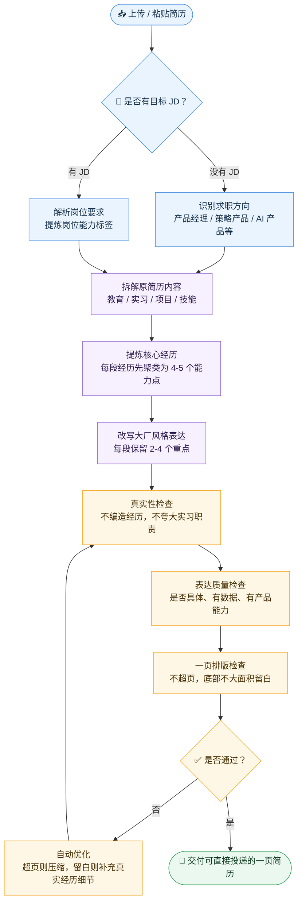

# 🧩 PM Resume Builder

一个帮助 AI Agent 生成和定制**中文产品经理简历**的 Skill。

适用于 Codex、Claude 和其他支持读取文件的 Agent。目标是输出一份**简洁、互联网大厂风格、一页以内的 Word 产品经理简历**。

## ✨ 能解决什么问题

### 1. 不会写产品经理简历

你可以提供零散信息，例如教育背景、实习经历、项目经历、校园经历、技能等。Agent 会帮你整理成产品经理简历结构，并改写成更专业的表达。

### 2. 针对岗位 JD 定制简历

你可以提供已有简历和目标岗位 JD。Agent 会提取岗位关键词，筛选最相关经历，调整内容顺序，并改写 bullet point，让简历更贴合目标岗位。

## 📥 支持的输入

### 简历输入

- 直接粘贴的文字
- Markdown 文件
- TXT 文件
- Word 文件：`.docx`
- PDF 文件：`.pdf`

### 岗位 JD 输入

- 直接复制粘贴的文字
- PDF 文件：`.pdf`
- 图片：`.png` / `.jpg` / `.jpeg` 等（需要模型/Agent有视觉/OCR能力）

## 📤 输出结果

默认输出：
- 一页产品经理简历
- Word `.docx` 文件

如果你需要，也可以让 Agent 同时输出 PDF。Skill 会优先检查 Word 文件是否真的为一页，再导出 PDF；不会通过放大字体或改版式来填充页面。

## 👋 你需要做什么

- 将你的帅照/美照放进简历里（如果有）
- 细节修改：根据你自己的特长修改细节，检查错别字，邮箱等基本信息（图片OCR可能会有问题）

## 🚀 如何下载到 Codex

把本项目复制到 Codex Skills 目录：

```bash
mkdir -p ~/.codex/skills
git clone https://github.com/Amory-ZDF/pm-resume-builder.git ~/.codex/skills/pm-resume-builder
```

然后开启新的 Codex 对话，即可使用：

```text
Use $pm-resume-builder ...
```

## 🤖 如何给 Claude 或其他 Agent 使用

如果 Agent 支持上传文件夹或项目文件：

1. 下载本项目。
2. 把整个 `pm-resume-builder` 文件夹上传给 Agent。
3. 告诉 Agent：先阅读 `SKILL.md`，再按里面的流程处理简历。

如果 Agent 不识别 Codex Skill 格式，也没关系，把 `SKILL.md` 当作主操作说明即可。

## 📝 使用提示词范式

按你的场景选择一个即可，具体排版、压缩、真实性校验和 Word 输出规则已经内置在 Skill 里，不需要重复写。

### 场景一：从 0 写或润色简历

```text
Use $pm-resume-builder

我想写/润色一份中文产品经理简历。下面是我的背景信息或已有简历：【粘贴内容，或说明已上传简历文件】。
```

### 场景二：根据岗位 JD 定制简历

```text
Use $pm-resume-builder

请根据我的简历和目标岗位 JD，帮我定制一份中文产品经理简历。简历是：【粘贴内容，或说明已上传简历文件】。岗位 JD 是：【粘贴内容，或说明已上传 JD 文件/图片】。
```

## 📁 项目结构

```text
pm-resume-builder/
├── SKILL.md
├── README.md
├── agents/openai.yaml
├── assets/resume_schema_example.json
├── references/
│   ├── input-handling.md
│   ├── reference-structure-standard.md
│   ├── writing-patterns.md
│   ├── honesty-guardrails.md
│   ├── jd-tailoring.md
│   ├── jd-multitag-capability-map.md
│   ├── quality-review-loop.md
│   └── one-page-docx-rules.md
└── scripts/
    ├── extract_resume_input.py
    ├── build_pm_resume_docx.py
    ├── build_pm_resume_pdf.py
    ├── check_resume_json.py
    ├── check_docx_layout.py
    └── export_docx_to_pdf.py
```

## 🧭 简历优化流程



## 📄 License

MIT License
